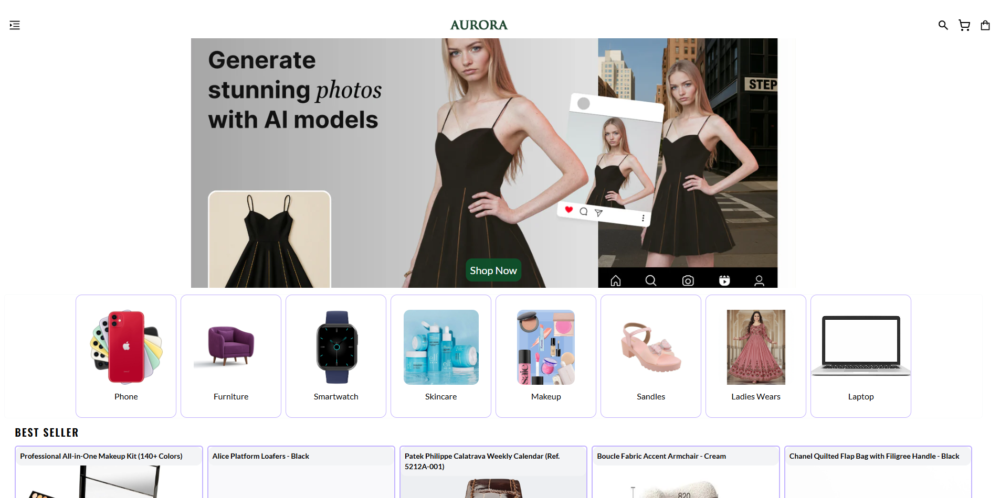
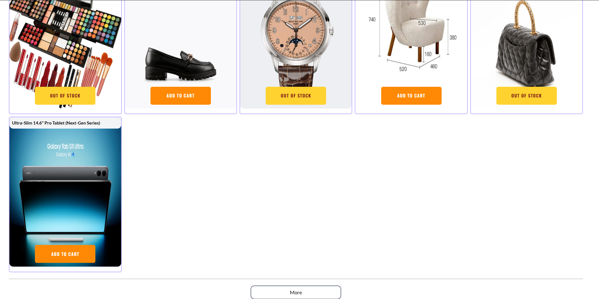
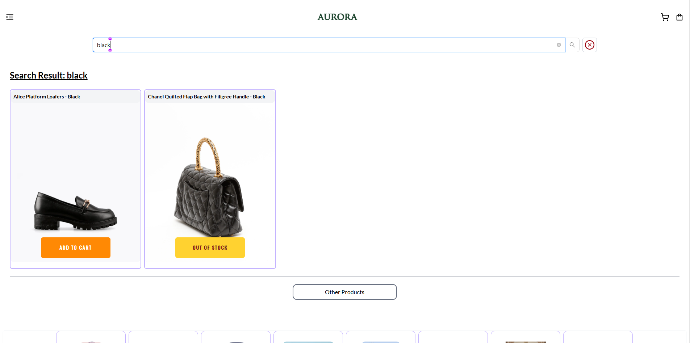
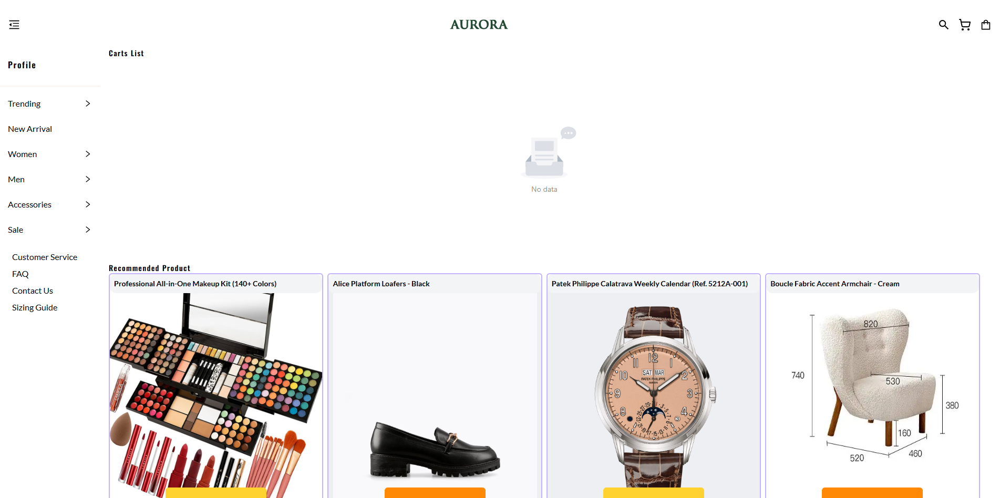
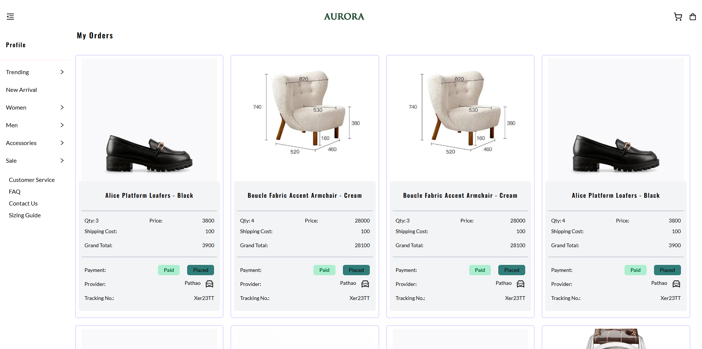
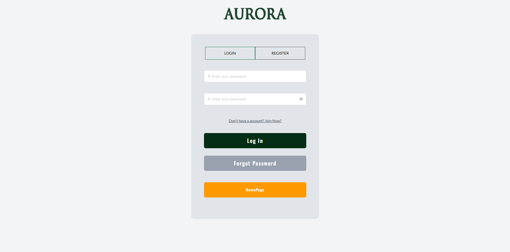
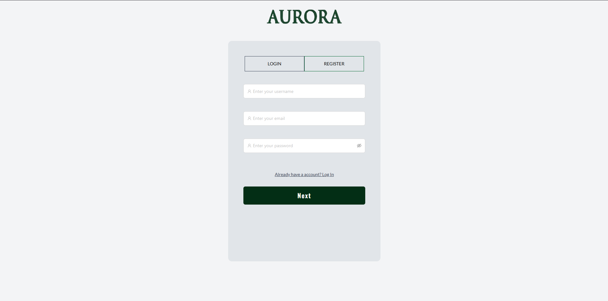
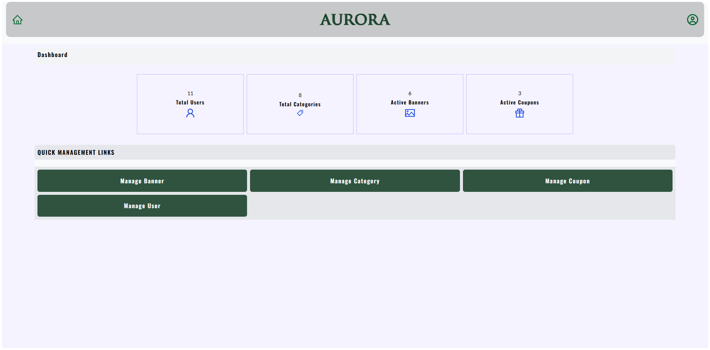

# 🛒 Aurora Shop — MERN E-Commerce Website

Aurora Shop is a simple and modern e-commerce website built using the **MERN stack**.  
It includes core features like product listing, search functionality, user login/register, and a clean, responsive UI.  
The backend is designed with secure API handling, proper folder structure, and smooth communication with the frontend.

---

## ✨ Features

### User Features
- View all products
- Search products by name
- View product details
- Register and Login (JWT authentication)
- Responsive and clean UI

### Backend Features
- Node.js + Express REST API
- MongoDB database connection
- Product CRUD operations
- User authentication with JWT
- CORS, Helmet, and Rate Limiting for security
- Optimized API integration for the frontend

---

## 🧩 Tech Stack

- **Frontend:** React.js (Vite), JavaScript, CSS  
- **Backend:** Node.js, Express.js  
- **Database:** MongoDB  
- **Tools:** Git, JWT, REST APIs  

---

## 📁 Project Structure
Aurora/
│── client/ # React frontend
│── server/ # Node + Express backend
│ ├──src 
|   |── models/
|   ├── services/
|   ├── utility/
|   ├── middleware/
|   └── config/
└── README.md


---

## 🖼️ Screenshots

```html








```

## 🚀 Run Locally
# Backend
cd server
npm install
npm start

# Frontend
cd client
npm install
npm run dev

### Summary
- Aurora Shop is a lightweight but fully functional MERN e-commerce project designed to showcase:
- Full-stack development (frontend + backend)
- API integration
- Secure authentication
- Clean UI and responsive design